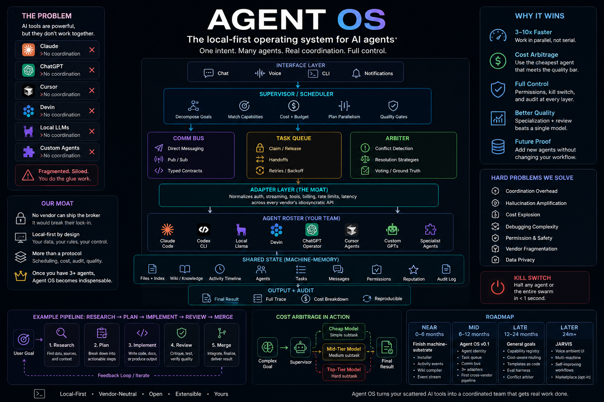
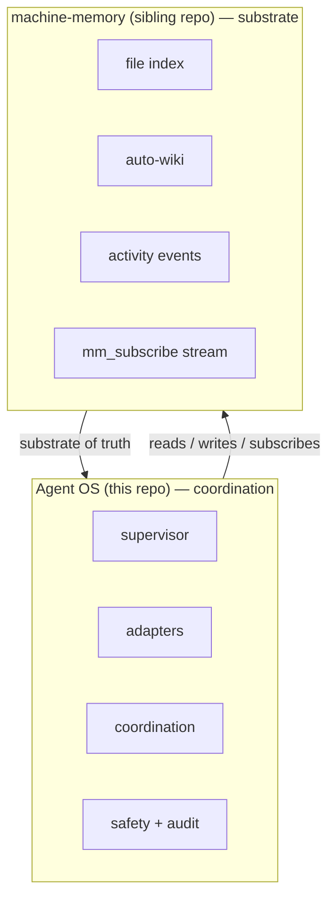

<div align="center">

# Agent OS

**The local-first operating system for AI agents.**

*One intent. Many agents. Real coordination. Full control.*

Created and maintained by **[Shifat Islam Santo (oneKn8)](https://github.com/oneKn8)** — also author of [`machine-memory`](https://github.com/oneKn8/machine-memory), the substrate Agent OS runs on.

[](./docs/00-vision.md)
[](./docs/00-vision.md#why-this-requires-go-or-rust--not-node-not-python)
[](https://github.com/oneKn8/machine-memory)
[](./LICENSE)
[](https://github.com/oneKn8/agent-os/commits)



</div>

---

## The pitch in one paragraph

Your AI agents are fragmented. Claude Code in one terminal, Codex CLI in another, Devin rented at $500/month, ChatGPT/Operator and Cursor in their own gardens, custom GPTs floating around, a local Llama for private work. **They don't talk to each other and no vendor will fix this** — every vendor's business model is lock-in. A cloud broker would just become another walled garden. **Local-first is the only natural home.** Agent OS sits in that hole: the broker that turns your scattered agents into one coordinated team, runs on your machine, talks to anything.

---

## What it actually does

A daemon (`agentd`, written in Go) that:

1. **Brokers** across local + cloud-rented + vendor-hosted agents through a normalized adapter layer
2. **Decomposes** your goals into subtasks and routes each to the cheapest agent that meets the quality bar
3. **Coordinates** their work via a typed comm bus, task queue, and conflict arbiter
4. **Audits** every action with full cost ledger + replay
5. **Enforces** permission gates and a kill switch for irreversible actions
6. **Shares state** through `machine-memory` (sibling repo) — files, activity, wiki, event stream

You state intent. The swarm does the work. You see what every agent did, what it cost, and you can halt anything in under a second.

---

## What it'll feel like

<details>
<summary><b>Click to expand a sample session (real GIF lands when v0.1 ships)</b></summary>

```bash
$ agentd status
roster online: claude-code-1, codex-cli-1, llama-local-3b, devin-rental-1
queue: 0 tasks pending
cost ledger today: $0.00

$ agent goal "research the DFW rental market and draft me a 5-property comparison"
[14:02:15] supervisor: decomposed into 3 subtasks
[14:02:15] cost estimate: $0.40 (range $0.18 - $0.85), latency ~3 min
[14:02:16] research-agent (codex-cli)  claimed: scrape 50 listings
[14:02:17] data-agent     (claude-code) claimed: build comparison table
[14:02:17] writer-agent   (claude-code) waiting for upstream
[14:04:33] research-agent done   47 listings    $0.12   2m17s
[14:04:50] data-agent     done   table built    $0.04   17s
[14:05:08] writer-agent   done   draft ready    $0.02   18s
[14:05:08] total: $0.18 across 3 agents in 2m53s
[14:05:08] result: ./outputs/dfw-rental-comparison.md  (preview attached)

$ agent show last
goal:        research DFW rental market...
agents:      research(codex-cli), data(claude-code), writer(claude-code)
audit:       /var/log/agentd/audit/2026-05-05/14:02:15-goal-7f3e.jsonl
cost:        $0.18 actual vs $0.40 estimated (55% under)
permissions: file-read(grant), web-fetch(grant), file-write(grant in ./outputs)
```

</details>

---

## How it stacks with `machine-memory`



`machine-memory` is the **shared filesystem of knowledge**. Agent OS is the **coordination layer on top.** Different repos, different ship cycles. Agent OS depends on machine-memory; machine-memory has no idea agent-os exists.

[See machine-memory →](https://github.com/oneKn8/machine-memory)

---

## Status

| Layer | State |
|---|---|
| Vision + scope locked | done — see [`docs/00-vision.md`](./docs/00-vision.md) |
| Roadmap drafted | done — see [`docs/02-roadmap.md`](./docs/02-roadmap.md) |
| Language decided (Go) | done — see [`docs/00-vision.md`](./docs/00-vision.md#why-this-requires-go-or-rust--not-node-not-python) |
| Substrate (machine-memory) Phase 1 | shipping (3/5 slices on main) |
| Substrate (machine-memory) Phase 2-3 | not started |
| Agent OS v0.1 (`agentd` daemon, first adapter) | not started — gated on substrate Phase 3 |
| Agent OS v0.4 (3 adapters, cross-vendor pipeline) | not started |
| JARVIS-feel ambient interface | not started — 24-36 month timeline |

---

## Why this requires Go (not Node, not Python)

Adapters need real concurrency. One daemon, dozens of in-flight upstream calls, each with its own streaming semantics + retry logic + cost tracking. Hot path needs predictable memory (no GC stalls during a critical handoff). Single-binary deployment matters because the daemon will run on every user's machine. eBPF tooling (`cilium/ebpf`) is reachable without an FFI maze. Full tradeoff matrix in [`docs/00-vision.md`](./docs/00-vision.md#why-this-requires-go-or-rust--not-node-not-python).

---

## Why "near AGI" is honest framing — but not what you might think

A great agent OS that orchestrates Claude + Codex + Devin + local LLMs will *feel* AGI-like for software engineering, research, content production — anywhere agents have strong tool access. **It will NOT make the underlying models smarter.** The intelligence ceiling is still the best individual model in the swarm.

That's not a limitation that should kill the vision — feeling AGI-like for 90% of daily work is enormous value. But the framing matters: **agent OS = orchestration leverage on top of frontier models**, not a path to a smarter model. Read [`docs/00-vision.md`](./docs/00-vision.md) §"What this is NOT" before getting excited.

---

## Documentation

- [**`docs/00-vision.md`**](./docs/00-vision.md) — full architecture, six boost mechanisms, fourteen hardcore-engineering problems (7 coordination + 7 adapter), language decision rationale
- [**`docs/01-scope.md`**](./docs/01-scope.md) — one-sentence goal, five success criteria, in/out of scope, non-goals
- [**`docs/02-roadmap.md`**](./docs/02-roadmap.md) — NEAR (substrate) → MID (v0.1) → LATE (general supervisor) → LATER (JARVIS), with explicit decision points

---

## Citation

If you use Agent OS in research, industry work, blog posts, or talks, please cite it. GitHub renders a "Cite this repository" button in the right sidebar from [`CITATION.cff`](./CITATION.cff). Plain-text form:

> Shifat Islam Santo (2026). *Agent OS: A Local-First Broker for Vendor-Neutral AI Agent Coordination.* https://github.com/oneKn8/agent-os

Full author list: [`AUTHORS`](./AUTHORS).

---

## License

[MIT](./LICENSE) © 2026 Shifat Islam Santo (oneKn8). Use it, fork it, build on it, sell things on top of it. The point is to keep the broker out of any single vendor's hands. Attribution preserved per the MIT clause.

The name **"Agent OS"** as applied to this project is the trademark of Shifat Islam Santo. Forks and derivatives are encouraged; please use a different name when distributing.
